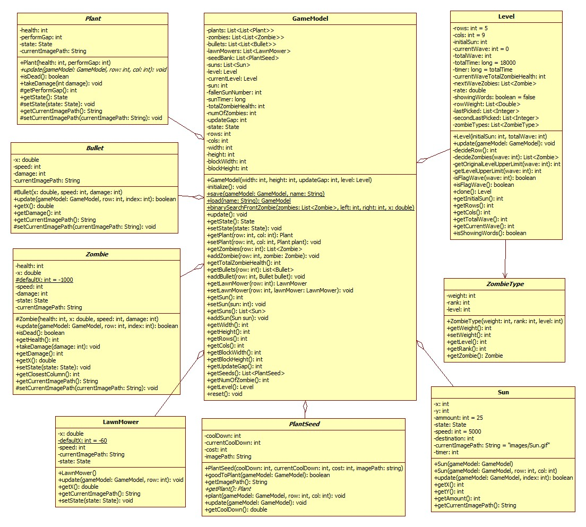
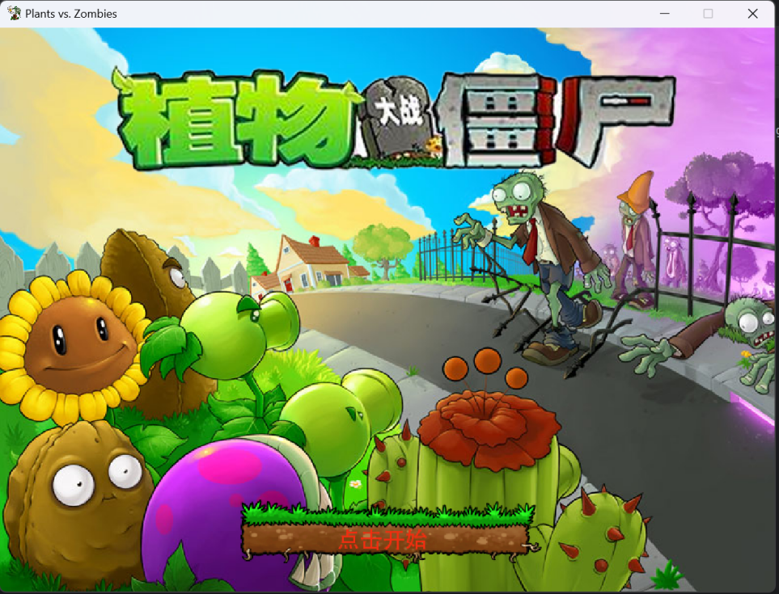
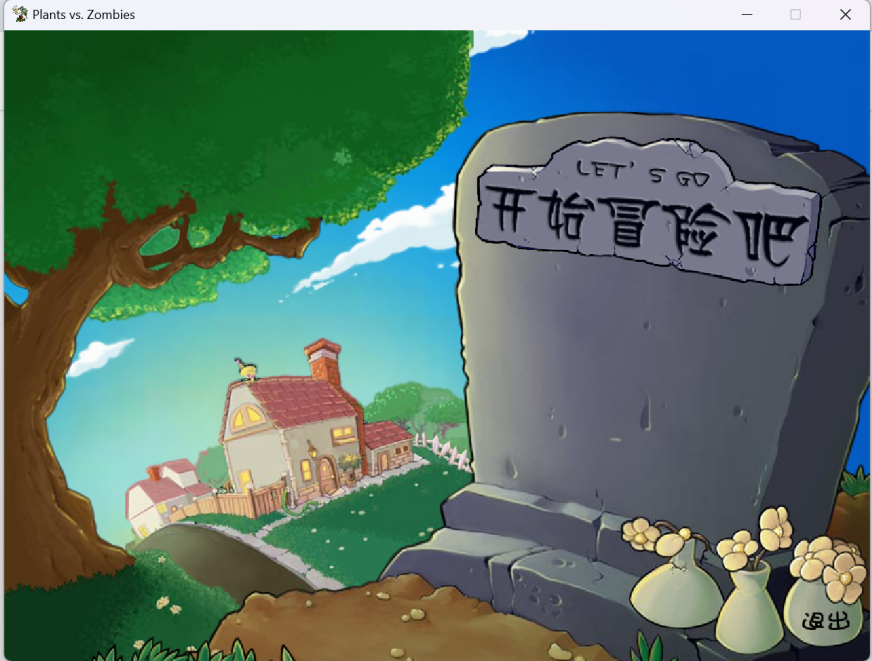
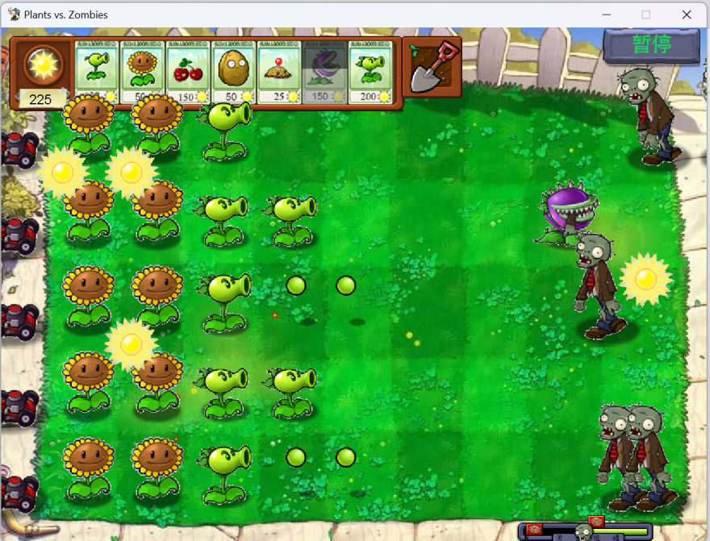
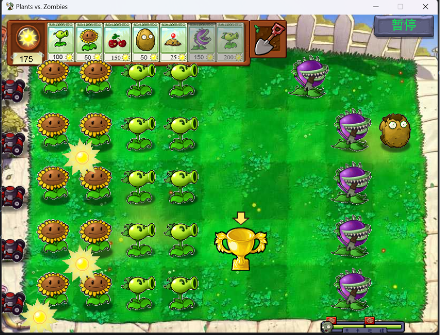
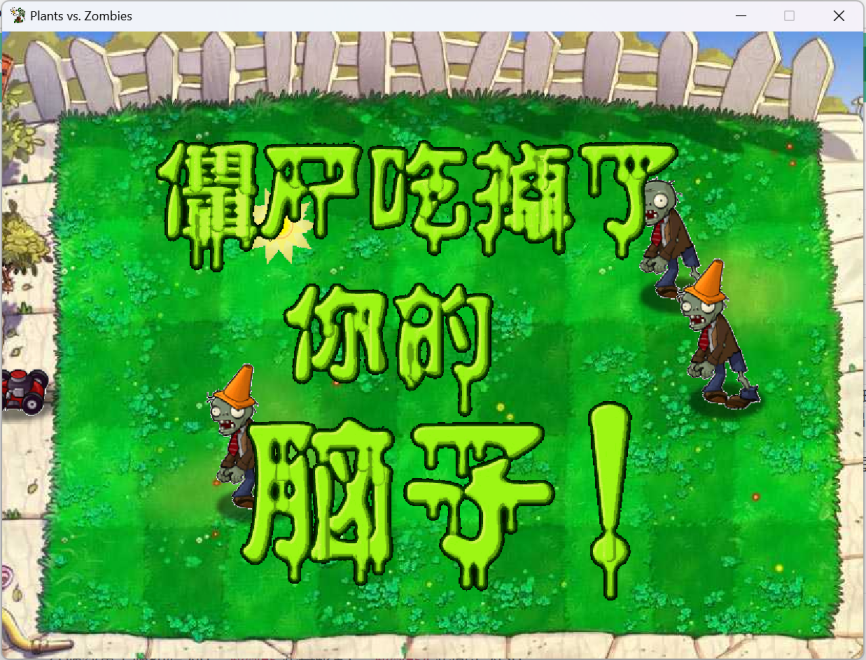

[[English]](README_en.md)
# 项目描述

本项目是本人和同学于大学期间做的Java课程设计项目，图形界面采用Java Swing。代码整体采用MVC架构。出怪机制以植物大战僵尸原版无尽模式的机制为基础进行修改。由于水平和经验不足，游戏游玩效果较为一般。

# 系统设计

代码分为model和view两部分，其中本人主要负责model部分，同学主要负责view部分。images目录存储图片资源，sounds目录存储音频资源。游戏采用数据集中更新的方式，每过一定的时间进行一次模型数据更新以及画面渲染。

## Model

model部分主要负责游戏数据的存储和处理以及关卡系统。

### 部分类图

### 代码结构

- model
    - bullet
        - Bullet.java (子弹基类)
        - Pea.java (豌豆类)
    - plant
        - Plant.java (植物基类)
        - CherryBomb.java (樱桃炸弹类)
        - Chomper.java (大嘴花类)
        - Peashooter.java (豌豆射手类)
        - PotatoMine.java (土豆地雷类)
        - Repeater.java (双发射手类)
        - Sunflower.java (向日葵类)
        - WallNut.java (坚果类)
    - seed
        - PlantSeed.java (种子基类)
        - CherryBombSeed.java (樱桃炸弹种子类)
        - ChomperSeed.java (大嘴花种子类)
        - PeashooterSeed.java (豌豆射手种子类)
        - PotatoMineSeed.java (土豆地雷种子类)
        - RepeaterSeed.java (双发射手种子类)
        - SunflowerSeed.java (向日葵种子类)
        - WallNutSeed.java (坚果种子类)
    - zombie
        - Zombie.java (僵尸基类)
        - BasicZombie.java (普通僵尸类)
        - BucketheadZombie (铁桶僵尸类)
        - ConeheadZombie.java (路障僵尸类)
    - GameModel.java (游戏模型类)
    - LawnMower.java (割草机类)
    - Level.java (关卡类)
    - Sun.java (太阳类)
    - ZombieType.java (僵尸类型类)

其中，GameModel为model部分的核心，用于游戏中各种数据的存储，例如场上的植物、僵尸、子弹、阳光等，并提供相应的方法进行数据的修改，例如种植物、更新数据。

## View

### 部分类图

### 代码结构

- view
    - award (获胜奖杯相关)
    - ingame (游戏中相关)
    - intromenu (首页相关)
    - PlayFrame.java (游戏界面管理类)

其中，ingame部分的GamePanel.java是游戏中的界面类，负责游戏中的画面渲染，使用model中的GameModel用于数据的存储与交互。

# 算法说明

为了能有好的游戏体验，需要设计一些算法来确定关卡中僵尸出现的行、类型、时间间隔等。以下是一些重要算法，以植物大战僵尸原版无尽模式机制为原型修改，详细资料请查看文末的[参考资料](#references)。

## 僵尸行选择算法

1. 对于第`i`行，有权重、上次选择、上上次选择三个信息。权重用于计算出怪内容，之前出怪用于计算出怪概率。将第i行权重定义为
   `rowWeight[i]`，为简化算法，在本项目的行算法中，`∀i∈[0,4],rowWeight[i]=0.2`.将第`i`行距离上次被选取定义为`lastPicked[i]`
   ，将第`i`行距离上上次被选取定义为`secondLastPicked[i]`，`lastPicked[i]`和`secondLastPicked[i]`的初始值为`0`。
2. 某一行出怪时，又称第`j`行插入事件。为了避免某行僵尸过多，当某一行出怪，游戏会减少该行出怪的概率，提高其他行的出怪概率。具体地，执行第j行插入事件时，会发生如下变化：
   `∀i∈[0,4]`，如果`rowWeight[i]>0`，则`lastPicked[i]`和`secondLastPicked[i]`均增加1，将`lastPicked[j]`的值赋给
   `secondLastPicked[j]`，将`lastPicked[j]`设为`0`,类似与计算机组成原理的Cache中的LRU替换算法。
3. 选取某次出怪的行，又称抽取行事件。将受到`lastPicked[i]`和`secondLastPicked[i]`影响后的`rowWeight[i]`称之为平滑权重，记为
   `smoothWeight[i]`。为计算平滑权重，将`lastPicked[i]`对结果的影响因子称为`pLast[i]`，再将`secondLastPicked[i]`对结果的影响因子称为
   `pSecondLast[i]`，通过参考资料中的研究结果，我们知道它们的计算公式是：
   $$pLast[i]=\frac{6×lastPicked[i]×rowWeight[i]+6×rowWeight[i]-3}{4}$$
   最终的平滑权重计算公式为：
   $$smoothWeight[i]=rowWeight[i]×min(max(pLast[i]+pSecondLast[i],0.01),100)$$

## 波次僵尸确定算法

1. 每个波次僵尸出现的级别之和有上限，记`currentWave`(从`0`开始)
   为即将更新的僵尸波次，那么原始级别上限$originalUpperLimit=currentWave/3+1$
   .对于普通波次，级别上限$levelUpperLimit=originalUpperLimit$.特别的，旗帜波(逻辑波次为`10`的倍数，即$currentWave\%10==9$)
   的级别上限$levelUpperLimit=originalUpperLimit×2.5$.
2. 不同类型的僵尸级别和刷新出现的权重不同，权重影响这出现该种类型僵尸概率，部分僵尸的级别和权重如表：

| 序号	 | 简称 | 级别 |  权重  | 备注                        |
|:---:|:--:|:--:|:----:|:--------------------------|
|  0  | 普僵 | 1  | 4000 | 轮数=5起每轮-180，轮数=25起固定为400  |
|  1  | 旗帜 | 1  |  0   | 无需出怪类型准许亦可生成，每个旗帜波有且仅有一只  |
|  2  | 路障 | 2  | 4000 | 轮数=5起每轮-150，轮数=25起固定为1000 |
|  3  | 撑杆 | 2  | 2000 |                           |
|  4  | 铁桶 | 4  | 3000 |                           |
|  5  | 读报 | 2  | 1000 |                           |
|  6  | 铁门 | 4  | 3500 |                           |
|  7  | 橄榄 | 7  | 2000 |                           |

3. 除此之外，僵尸还有阶数，阶数决定了僵尸会从第几波开始有概率出现。部分阶数的僵尸如表所示：

| 阶数   | 包含             | 限制            |
|:-----|:---------------|:--------------|
| 一阶僵尸 | 普僵、路障、铁桶、读报、雪人 | 第1波开始就可以出现    |
| 二阶僵尸 | 撑杆、铁门、橄榄、舞王    | 至少从第5波开始才可以出现 |

4. 对于普通波次的僵尸，每次选择僵尸时，先将`级别<剩余级别`的僵尸加入允许数组`allowedZombieTypes`
   中，再根据权重生成加权随机数以确实选择的僵尸，重复直至剩余级别上限为`0`.
5. 对于旗帜波，先固定出现的普通僵尸数量为$1+min(originalLevelUpperLimit,8)$,剩余的级别先用于普通波次相同的算法进行僵尸选择，但不将普通僵尸加入允许数组。若剩余级别恰为
   `1`，再将一个普通僵尸加入结果僵尸数组。

# 运行效果

# 参考资料

[技术:出怪机制 - PVZ Wiki](
https://wiki.pvz1.com/doku.php?id=%E6%8A%80%E6%9C%AF:%E5%87%BA%E6%80%AA%E6%9C%BA%E5%88%B6#%E5%87%86%E8%AE%B8)

[植僵百科知识 - 植僵工具箱](
https://pvz.tools/wiki/)

[关于出怪列表的机制及其衍生研究【植物大战僵尸吧】_百度贴吧](
https://tieba.baidu.com/p/9132193790)

[关于出怪列表的填充：级别容量上限、固定出怪、无限制出怪…… - 哔哩哔哩](
https://www.bilibili.com/opus/753887071276367875)

[植物大战僵尸百科 | Fandom](
https://pvz.fandom.com/zh/wiki/%E6%A4%8D%E7%89%A9%E5%A4%A7%E6%88%98%E5%83%B5%E5%B0%B8%E7%99%BE%E7%A7%91)

[出怪论：出怪的选行【植物大战僵尸吧】_百度贴吧](
https://tieba.baidu.com/p/8048386143)