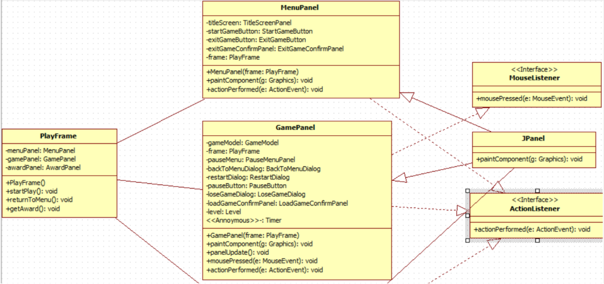
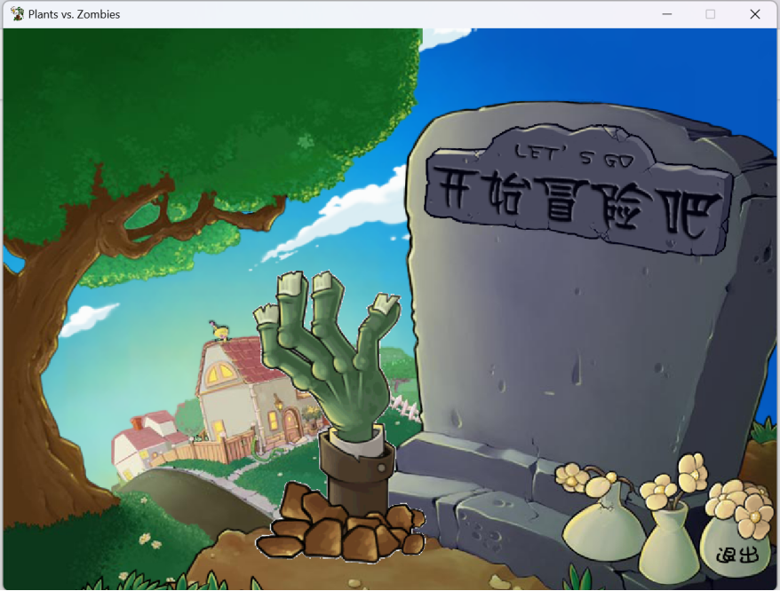
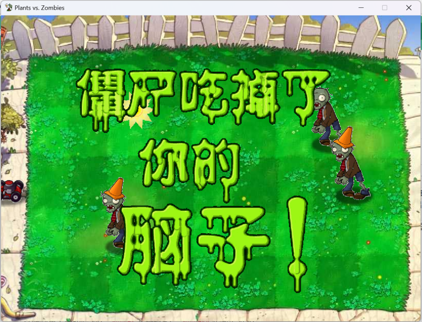

[[简体中文]](README.md)
# Project Description

This project is a Java course design project developed by me and my classmates during university. The graphical interface is implemented using Java Swing, and the overall code follows the MVC (Model-View-Controller) architecture. The zombie spawning mechanism is based on the endless mode of the original Plants vs. Zombies game, with some modifications. Due to limited experience and skill, the gameplay experience is relatively basic.

# System Design

The code is divided into two main parts: `model` and `view`. I was primarily responsible for the `model` part, while my classmate handled the `view` part. The `images` directory stores image resources, and the `sounds` directory stores audio resources. The game updates its data and renders the screen at regular intervals.

## Model

The `model` part is responsible for storing and processing game data, as well as managing the level system.

### Partial Class Diagram

### Code Structure

- model
    - bullet
        - Bullet.java (Base class for bullets)
        - Pea.java (Pea class)
    - plant
        - Plant.java (Base class for plants)
        - CherryBomb.java (Cherry Bomb class)
        - Chomper.java (Chomper class)
        - Peashooter.java (Peashooter class)
        - PotatoMine.java (Potato Mine class)
        - Repeater.java (Repeater class)
        - Sunflower.java (Sunflower class)
        - WallNut.java (Wall-nut class)
    - seed
        - PlantSeed.java (Base class for seeds)
        - CherryBombSeed.java (Cherry Bomb seed class)
        - ChomperSeed.java (Chomper seed class)
        - PeashooterSeed.java (Peashooter seed class)
        - PotatoMineSeed.java (Potato Mine seed class)
        - RepeaterSeed.java (Repeater seed class)
        - SunflowerSeed.java (Sunflower seed class)
        - WallNutSeed.java (Wall-nut seed class)
    - zombie
        - Zombie.java (Base class for zombies)
        - BasicZombie.java (Basic Zombie class)
        - BucketheadZombie (Buckethead Zombie class)
        - ConeheadZombie.java (Conehead Zombie class)
    - GameModel.java (Core game model class)
    - LawnMower.java (Lawn Mower class)
    - Level.java (Level class)
    - Sun.java (Sun class)
    - ZombieType.java (Zombie type class)

The `GameModel` class is the core of the `model` part, storing various game data such as plants, zombies, bullets, and sunlight. It also provides methods to modify this data, such as planting plants and updating game state.

## View

### Partial Class Diagram

### Code Structure

- view
    - award (Related to winning trophies)
    - ingame (In-game related)
    - intromenu (Main menu related)
    - PlayFrame.java (Game interface management class)

The `GamePanel.java` in the `ingame` section is responsible for rendering the in-game interface. It interacts with the `GameModel` from the `model` part to store and retrieve game data.

# Algorithm Explanation

To ensure a good gameplay experience, several algorithms were designed to determine the row, type, and timing of zombie spawns. These algorithms are based on the endless mode mechanics of the original Plants vs. Zombies game, with some modifications. For more details, refer to the [References](#references) section at the end.

## Zombie Row Selection Algorithm

1. For each row `i`, there are three pieces of information: weight, last picked, and second last picked. The weight is used to calculate the spawn content, while the previous spawns are used to calculate the spawn probability. The weight for row `i` is defined as `rowWeight[i]`. For simplicity, in this project, `∀i∈[0,4], rowWeight[i]=0.2`. The time since the last pick for row `i` is defined as `lastPicked[i]`, and the time since the second last pick is defined as `secondLastPicked[i]`. Both `lastPicked[i]` and `secondLastPicked[i]` are initialized to `0`.
2. When a zombie spawns in row `j` (referred to as a row insertion event), the game reduces the spawn probability for that row and increases it for other rows. Specifically, when row `j` is inserted, the following changes occur:
   `∀i∈[0,4]`, if `rowWeight[i]>0`, then `lastPicked[i]` and `secondLastPicked[i]` are incremented by 1. The value of `lastPicked[j]` is assigned to `secondLastPicked[j]`, and `lastPicked[j]` is set to `0`. This is similar to the LRU (Least Recently Used) replacement algorithm in computer architecture.
3. Selecting a row for a zombie spawn (referred to as a row extraction event) is influenced by `lastPicked[i]` and `secondLastPicked[i]`. The adjusted weight, called the smooth weight, is denoted as `smoothWeight[i]`. The influence of `lastPicked[i]` is denoted as `pLast[i]`, and the influence of `secondLastPicked[i]` is denoted as `pSecondLast[i]`. Based on research from the references, the formulas are:
   $$pLast[i]=\frac{6×lastPicked[i]×rowWeight[i]+6×rowWeight[i]-3}{4}$$
   The final smooth weight is calculated as:
   $$smoothWeight[i]=rowWeight[i]×min(max(pLast[i]+pSecondLast[i],0.01),100)$$

## Wave Zombie Determination Algorithm

1. Each wave has a limit on the total level of zombies that can spawn. Let `currentWave` (starting from `0`) be the current wave. The original level limit is calculated as:
   $$originalUpperLimit=currentWave/3+1$$
   For normal waves, the level limit is `originalUpperLimit`. For flag waves (waves where `currentWave % 10 == 9`), the level limit is:
   $$levelUpperLimit=originalUpperLimit×2.5$$
2. Different types of zombies have different levels and spawn weights, which affect their spawn probability. Some zombie types and their weights are shown below:

| ID  | Name   | Level | Weight | Notes                                      |
|:---:|:------:|:-----:|:------:|:------------------------------------------|
|  0  | Basic  | 1     | 4000   | Decreases by 180 after wave 5, fixed at 400 after wave 25 |
|  1  | Flag   | 1     | 0      | Only one per flag wave, no weight required               |
|  2  | Conehead| 2     | 4000   | Decreases by 150 after wave 5, fixed at 1000 after wave 25|
|  3  | Pole   | 2     | 2000   |                                            |
|  4  | Bucket | 4     | 3000   |                                            |
|  5  | Newspaper| 2     | 1000   |                                            |
|  6  | Screen | 4     | 3500   |                                            |
|  7  | Giga   | 7     | 2000   |                                            |

3. Zombies also have tiers, which determine the earliest wave they can appear in. Some zombie tiers are shown below:

| Tier | Includes                     | Restrictions                  |
|:----:|:----------------------------:|:-----------------------------:|
| Tier 1 | Basic, Conehead, Bucket, Newspaper, Snowman | Can appear from wave 1        |
| Tier 2 | Pole, Screen, Giga, Dancer    | Can appear from wave 5 onwards|

4. For normal waves, zombies are selected by first adding zombies with `level < remaining level` to the `allowedZombieTypes` array. Then, a weighted random number is generated to select the zombie type. This process repeats until the remaining level limit is `0`.
5. For flag waves, the number of basic zombies is fixed at `1 + min(originalLevelUpperLimit, 8)`. The remaining level limit is used to select zombies using the same algorithm as normal waves, but basic zombies are not added to the `allowedZombieTypes` array. If the remaining level is exactly `1`, a basic zombie is added to the result array.

# Screenshots

# References

[Technology: Spawning Mechanism - PVZ Wiki](https://wiki.pvz1.com/doku.php?id=%E6%8A%80%E6%9C%AF:%E5%87%BA%E6%80%AA%E6%9C%BA%E5%88%B6#%E5%87%86%E8%AE%B8)

[Plants vs. Zombies Encyclopedia - PVZ Toolbox](https://pvz.tools/wiki/)

[Research on Spawning List Mechanism and Its Derivatives - Baidu Tieba](https://tieba.baidu.com/p/9132193790)

[About Spawning List Filling: Level Capacity, Fixed Spawns, Unlimited Spawns... - Bilibili](https://www.bilibili.com/opus/753887071276367875)

[Plants vs. Zombies Wiki | Fandom](https://pvz.fandom.com/zh/wiki/%E6%A4%8D%E7%89%A9%E5%A4%A7%E6%88%98%E5%83%B5%E5%B0%B8%E7%99%BE%E7%A7%91)

[Spawning Theory: Row Selection for Spawning - Baidu Tieba](https://tieba.baidu.com/p/8048386143)